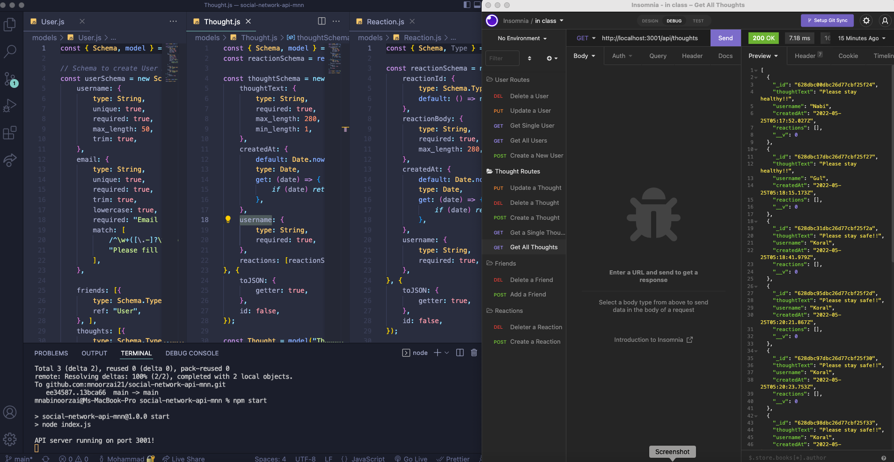

# social-network-api-mnn

## Description

This is an social network api application which can hold users, thoughts, and reactions. The users can are able to add, find, update, and delete users, friends, thoughts, and reactions. Technology used in this app are Javascript, Express, MongoDB, Mongoose, and Nodeja. The app starts when the user runs `npm init -y`, `npm install express`, and `npm start`.

[Repo Link](https://github.com/mnoorzai21/social-network-api-mnn)

[Walkthrough Video Link](https://drive.google.com/drive/folders/1CzZzK_CduH0BjYJSFmuu-7EazG9W7sO_?usp=sharing)

## Contacts

GitHub: [https://github.com/mnoorzai21](https://github.com/mnoorzai21)

Email: [mnoorzai21@gmail.com](mnoorzai21@gmail.com)
